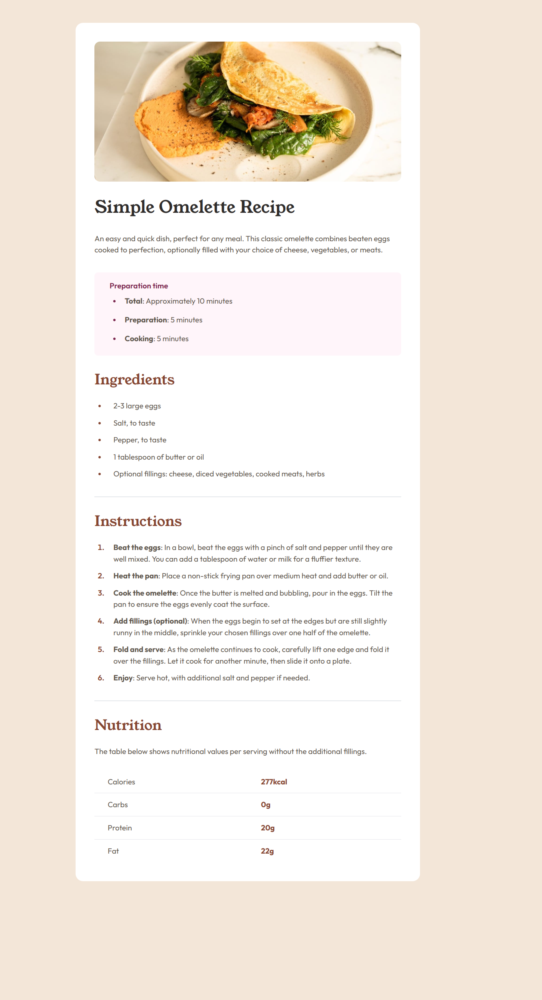

# Frontend Mentor - QR code component solution

This is a solution to the [Recipe page challenge on Frontend Mentor](https://www.frontendmentor.io/challenges/recipe-page-KiTsR8QQKm).

## Table of contents

- [Overview](#overview)
  - [Screenshot](#screenshot)
  - [Links](#links)
- [My process](#my-process)
  - [Built with](#built-with)
  - [Useful resources](#useful-resources)
- [Author](#author)

## Overview

### Screenshot

### Links

- Solution URL: https://github.com/ddosia/fm_challenges/tree/main/recipe-page
- Live Site URL: https://ddosia.github.io/recipe-page/src/index.html

## My process

### Built with

- [Tailwind CSS](https://tailwindcss.com/)
- Flexbox

## Author

- [Telegram](https://t.me/ddosia)
- [Frontend Mentor](https://www.frontendmentor.io/profile/ddosia)
